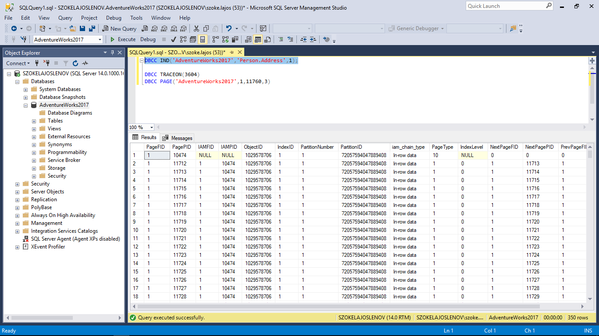
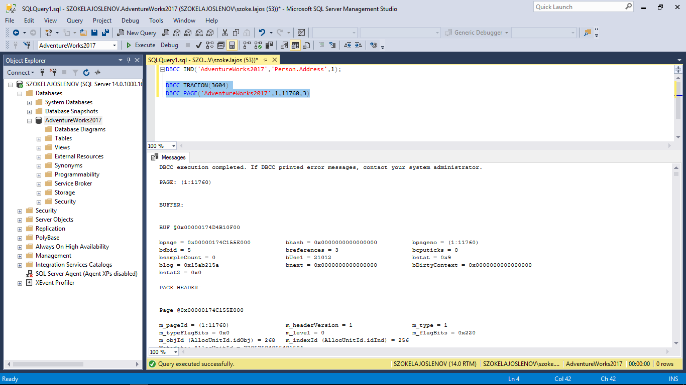

<div>
   <font size="2" color="red">This is some text!</font>
</div>

## Explore Page Structure

1. Start Microsoft SQL Server Management Studio and connect to your database instance.
2. Click New Query, select the AdventureWorks2017 database, type the following Transact-SQL into the query window, then click Execute:
``` sql
SELECT db_name(database_id) AS Database_Name, 
	object_name([object_id]) AS Table_Name, 
	allocation_unit_type, 
	allocation_unit_type_desc,
	allocated_page_file_id, 
	allocated_page_page_id, 
	page_type, 
	page_type_desc 
FROM  sys.dm_db_database_page_allocations(db_id('AdventureWorks2017'),NULL,NULL,NUll,'DETAILED')
WHERE object_name([object_id])='Product'
AND   page_type IS NOT NULL;
```
3. Examine the query results, nothing that there are three page types: IAM pages, index pages, and data pages.

## Explore the Index Statistics

1. In the Microsoft SQL Server Management Studio query window, type the following Transact-SQL to examine the indexes for the Product table, then highlight the code and click Execute:
``` sql
SELECT db_name(database_id) AS Database_Name, 
	object_name([object_id]) AS Table_Name, 
	index_id,
	partition_number,
	index_type_desc,
	alloc_unit_type_desc,
	index_depth,
	index_level,
	avg_fragmentation_in_percent,
	fragment_count,
	avg_fragment_size_in_pages,
	page_count
FROM  sys.dm_db_index_physical_stats (db_id('AdventureWorks2017'),NULL,NULL,NULL,NULL)
WHERE object_name([object_id])='Product'
```
2. Examine the query results, noting the index types and fragmentation.

## DBCC IND and DBCC PAGE

**DBCC IND**: It is one of the undocumented commands, It is not supported by Microsoft. This command helps in identifying the page numbers that table or index is using. The syntax looks like below. 

**Syntax**: DBCC IND (‘DBName’ or DBID, ‘TableName’ or ObjectId, NOn Clustred Index ID)

The third parameter can be the Non Clustered Index Id from Sys.indexes table or 1 or 0 or -1 or -2.  -1 provides complete information about all type of pages ( in row data, row over flow data, IAM, all indexes ) associated with the table.



**Explanation of the what does each column mean:**

* PageFID — the file ID of the page
* PagePID — the page number in the file
* IAMFID — the file ID of the IAM page that maps this page (this will be NULL for IAM pages themselves as they’re not self-referential)
* IAMPID — the page number in the file of the IAM page that maps this page
* ObjectID — the ID of the object this page is part of
* IndexID — the ID of the index this page is part of
* PartitionNumber — the partition number (as defined by the partitioning scheme for the index) of the partition this page is part of
* PartitionID — the internal ID of the partition this page is part of
* iam_chain_type — see IAM chains and allocation units in SQL Server 2005
* PageType — the page type. Some common ones are:
   * 1 – data page  
   * 2 – index page 
   * 3 and 4 – text pages 
   * 8 – GAM page 
   * 9 – SGAM page 
   * 10 – IAM page 
   * 11 – PFS page
* IndexLevel — what level the page is at in the index (if at all). Remember that index levels go from 0 at the   leaf to N at the root page (except in clustered indexes in SQL Server 2000 and 7.0 – where there’s a 0 at the leaf level (data pages) and a 0 at the next level up (first level of index pages))
* NextPageFID and NextPagePID — the page ID of the next page in the doubly-linked list of pages at this level of the index
* PrevPageFID and PrevPagePID — the page ID of the previous page in the doubly-linked list of pages at this   level of the index

**DBCC PAGE**: It is another undocumented command. As the name suggests this command helps view the contents of the data and index pages. The result of this command is little hard to understand. The syntax looks like below. 

**Syntax:** DBCC PAGE(‘DBName’ or DBID, FileNumber, PageNumber, PrintOption)
   PrintOption can be 0 or 1 or 2 or 3 – each option provides different information.




